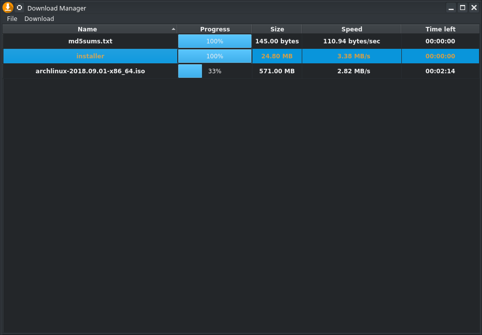
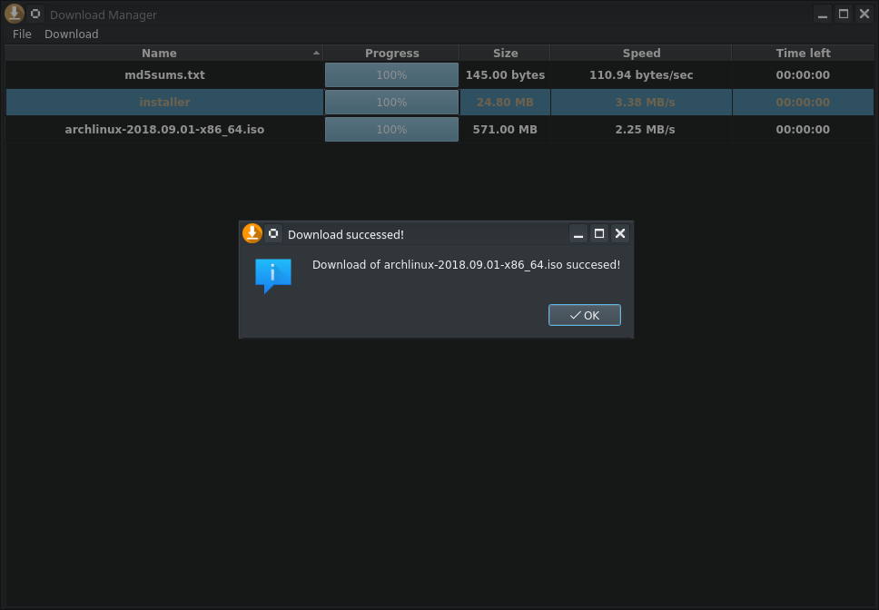

##  PayPal Payments Standard Donate 
[](http://paypal.me/MohamedOsama914/5)

[](https://createbrowser.github.io/ACefSharpChromiumBrowserNewWindowsDesktopPC/PayPal.html)

 [](https://github.com/blooser/Download-Manager) 

# Manage the downloading data.

Charming manager helps you to easily track downloading stuff from the Internet.



<b>It informs about the download finish.</b>



[](https://github.com/CreateDownloader/SGet/releases/tag/v1.0)

***
## Architecture.
One single download is represented by `DownloadProcess`

It contains the URL to stuff and pointer to `DownloadTable`

```cpp
DownloadProcess::DownloadProcess(QUrl url, DownloadTable *dataModel){
    this->dataModel = dataModel;
    this->url = url;

    downloadTime.start();
    manager = new QNetworkAccessManager(this);
}
```
`start` method call the request and start the download process. 

```cpp
void DownloadProcess::start(){
    QNetworkRequest request(url);
    currentDownload = manager->get(request);

    connect(manager, SIGNAL(finished(QNetworkReply*)), this, SIGNAL(downloadFinished(QNetworkReply*)));
    connect(currentDownload, SIGNAL(downloadProgress(qint64,qint64)), this, SLOT(downloadProgress(qint64,qint64)));
}
```
- <b>connect</b> `currentDownload`  track pieces of information about the downloading process.
- <b>connect</b> `manager` call when the download process is finished.

Analogously  `abort` method stop the download and <b>disconnect</b> `currentDownload` and `manager`

### Download progress.

Track data about the downloading process and put it in the table.


```cpp
void DownloadProcess::downloadProgress(qint64 received, qint64 total){
    double downloadSpeedInfo = received * 1000.0 / downloadTime.elapsed();
    double downloadSpeed  = downloadSpeedInfo;
    int progress = (100*received)/total;
    size = sizeHuman(total);

    QString unit;
    if(downloadSpeedInfo < 1024) unit = "bytes/sec";
    else if(downloadSpeedInfo < 1024 * 1024){
        downloadSpeedInfo /= 1024;
        unit = "kB/s";
    }else{
        downloadSpeedInfo /= (1024 * 1024);
        unit = "MB/s";
    }

    QString speedFormat;
    speedFormat.sprintf("%6.2f", downloadSpeedInfo);

    QString speed = speedFormat + " " + unit;

    int secondsToFinishDownload = (total-received)/downloadSpeed;
    QString timeLeft = timeHuman(secondsToFinishDownload);

    QString filenameToFind = url.fileName();
    int row = dataModel->getRowOfDownloadByName(filenameToFind);

    QModelIndex index = dataModel->index(row, 1, QModelIndex());
    dataModel->setData(index, progress, Qt::EditRole);

    index = dataModel->index(row, 2, QModelIndex());
    dataModel->setData(index, size, Qt::EditRole);

    index = dataModel->index(row, 3, QModelIndex());
    dataModel->setData(index, speed, Qt::EditRole);

    index = dataModel->index(row, 4, QModelIndex());
    dataModel->setData(index, timeLeft, Qt::EditRole);
}
```
- `double downloadSpeed  = downloadSpeedInfo;` - `downloadSpeedInfo` Contains information in human format about speed like `12 Mb/s`, `downloadSpeed` contains speed only in bytes, its is used to calculate `secondsToFinishDownload`
- `QModelIndex index` Is used to put the data into correct single the data table column.

### Single download info.

`DownloadTable` has a `QList` of `singleDownloadInfo` struct which contains necessary info about the download process.

```cpp
struct singleDownloadInfo{
    QString name;
    qint64 progress;
    QString size;
    QString speed;
    QString timeLeft;

    bool operator==(const singleDownloadInfo &);
};
```

## Manage downloads.

To start new download manager needs URL to data to download.

```cpp
void DownloadWidget::start(){
    QString downloadUrl = getDownloadUrl();
    QUrl url = QUrl::fromEncoded(downloadUrl.toLocal8Bit());

    if(downloadTable->filenameExist(url.fileName())){
        QMessageBox::information(this, "Duplicate data!",
                                 tr("There is %1 already in downloads!").arg(url.fileName()));
        return;
    }

    if(!downloadUrl.isEmpty()){
        QRegularExpression urlRegex("^(?:http|ftp)s?://");
        QRegularExpressionMatch match = urlRegex.match(downloadUrl);

        if(!match.hasMatch()){
            QMessageBox::critical(this, "Error", "Incorrect URL", QMessageBox::Ok);
            return;
        }
        
        insertDownloadingFilenameInTable(url.fileName());
        download(url);
    }
}
```
- `QString downloadUrl = getDownloadUrl();` Start download dialog and return URL to data.
- `QUrl url = QUrl::fromEncoded(downloadUrl.toLocal8Bit());` Convert to `QUrl`
- `if(downloadTable->filenameExist(url.fileName()))` Check for this download file exists.
    - On true show dialog and return.
- `if(!downloadUrl.isEmpty())` Check for URL is not empty.
    - ` QRegularExpression urlRegex("^(?:http|ftp)s?://");` Prepare regex to validate for URL is correct address to data.
        - `if(!match.hasMatch())` On not valid show dialog and return.
- `insertDownloadingFilenameInTable(url.fileName());` Put filename into table.
- `download(url);` Start the download process.

### Download dialog.

`DownloadDialog` is used to get URL from the user.

```cpp
QString DownloadWidget::getDownloadUrl(){
    DownloadDialog dialog;
    QString getUrl;

    if(dialog.exec()) getUrl = dialog.downloadUrl->text();
    return getUrl;
}
```
- `if(dialog.exec()) getUrl = dialog.downloadUrl->text();` On the dialog work convert `downloadUrl` to text and assign it into `getUrl` and return.

### Download.

Initialize `DownloadProcess` with URL and start the process.

```cpp
void DownloadWidget::download(QUrl &url){
    DownloadProcess *downloadProcess;
    downloadProcess = new DownloadProcess(url, downloadTable);
    downloadProcess->start();
    downloads[url.fileName()] = downloadProcess;

    connect(downloadProcess, SIGNAL(downloadFinished(QNetworkReply*)), this, SLOT(downloadFinished(QNetworkReply*)));
}
``` 
- `downloadProcess = new DownloadProcess(url, downloadTable);` Initialize with url and pointer to the data table.
    - The pointer is required to correctly put pieces of information about the download process into the single row.
- `downloads[url.fileName()] = downloadProcess;` `downloads` which is hashmap is used to locate currently working download process.
- <b>connect</b> `downloadProcess` on finish download.

### Download finished.

Catch the finish signal of download and take actions.

```cpp
void DownloadWidget::downloadFinished(QNetworkReply *reply){
    QUrl url = reply->url();
    downloads.remove(url.fileName());

    if(!reply->error()){
        if(isHttpRedricted(reply)) QMessageBox::information(this, "Redricted", "HTTP Redricted");
        else{
            QString filename = saveFileName(url);
            if(saveToDisk(filename, reply))
                QMessageBox::information(this, "Download successed!", tr("Download of %1 succesed!").arg(filename));
        }
    } else QMessageBox::warning(this, "Error", tr("Download error %1").arg(reply->errorString()));
}
``` 
- `QUrl url = reply->url();` Get url to downloaded data, `reply` contains informations about the server where data comes.
- `downloads.remove(url.fileName());` Data downloaded, the manager doesn't need it anymore.
- `if(!reply->error())` Check connection errors happened.
    - `if(isHttpRedricted(reply))` Is HTTP redricted?
    -  The connection is fix and download finished. 
        - `if(saveToDisk(filename, reply)` Try to save data to disk.

### Save to disk.

Save downloaded stuff.

```cpp
bool DownloadWidget::saveToDisk(const QString & filename, QIODevice *data){
    QFile file(filename);

    if(!file.open(QIODevice::WriteOnly)) return false;
    file.write(data->readAll());
    file.close();
    return true;
}
```
- `QFile file(filename);` Save with downloaded filename.
- `if(!file.open(QIODevice::WriteOnly))` IO errors happened?
- Everything is fix.
    - `file.write(data->readAll());` Write data.

## Session.

`DownloadWidget` saves all data in `DownloadTable` and URLs of did not finish download processes on program exit.

```cpp
void DownloadWidget::saveSession(){
    QFile file(".downloadManagerSession");

    if(file.open(QIODevice::WriteOnly)){
        QDataStream stream(&file);
        int row = downloadTable->rowCount(QModelIndex());
        int column = downloadTable->columnCount(QModelIndex());
        stream<<row<<column;

        QModelIndex index;
        REP(i, row){
                REP(j, column){
                    index = downloadTable->index(i, j, QModelIndex());
                    stream << downloadTable->data(index, Qt::DisplayRole);
            }
        }

        foreach(QString key, downloads.keys())
            stream<<downloads.value(key)->getUrl();
    }

    file.close();
}
```
- First are numbers of row and column of the data table.
- Second is downloads pieces of information.
- On `downloads` contains some data.
    - Save URLs.

#### On program start `DownloadWidget` load session.

```cpp
void DownloadWidget::loadSession(){
    QFile file(".downloadManagerSession");

    if(file.open(QIODevice::ReadOnly)){
        QDataStream stream(&file);
        int row, column;

        stream >> row >> column;
        downloadTable->insertRows(0, row, QModelIndex());

        QModelIndex index;
        REP(i, row){
                REP(j, column){
                    index = downloadTable->index(i, j);
                    downloadTable->setData(index, stream, Qt::EditRole);
            }
        }

        while(!stream.atEnd()){
            QUrl url;
            stream >> url;

            DownloadProcess *downloadProcess;
            downloadProcess = new DownloadProcess(url, downloadTable);
            downloads[url.fileName()] = downloadProcess;

            connect(downloadProcess, SIGNAL(downloadFinished(QNetworkReply*)), this, SLOT(downloadFinished(QNetworkReply*)));
        }
    }

    file.close();
}
```
- Build `DownloadTable` and put all the data.
- `while(!stream.atEnd())` While contains URLs.
    - `stream >> url;` Get URL.
    - `downloadProcess = new DownloadProcess(url, downloadTable);` Prepare the download process.
    - `downloads[url.fileName()] = downloadProcess;` Put filename into `downloads`
    - <b>connect</b> `downloadProcess` on download finished.
